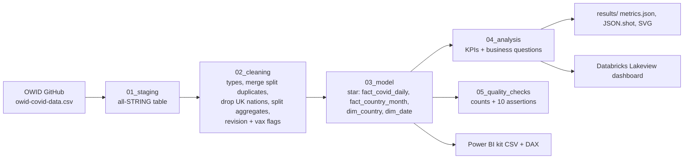

# da-learn-14 · COVID-19 global analysis (2020–2024, Our World in Data)

An end-to-end data-analyst project on the **complete Our World in Data COVID-19 file**: 429,435 raw rows and 67 columns, covering 239 countries from 2020-01-01 to 2024-08-14. The raw CSV goes through staging, cleaning (merging split duplicate rows, separating OWID aggregates, removing double-counted UK nations, and flagging revisions and over-100% vaccination), and a star schema. Analysis SQL then answers questions about deaths, case fatality, vaccination coverage, waves, age structure and income. The same SQL runs locally on DuckDB and on Databricks SQL (Unity Catalog with a published Lakeview dashboard), and there is a Power BI kit for building the report yourself.


## Business questions
1. How many cases and deaths were reported worldwide, and what is the overall case fatality rate (CFR)?
2. Which continents and countries were hit hardest per million people?
3. When did each continent's deadliest month occur, and how did the waves move around the world?
4. How did the CFR change year by year as vaccines and Omicron arrived?
5. How unequal was vaccination coverage across income groups and countries?
6. Do population age and vaccination level by the end of 2021 explain later death rates?

## Pipeline


## Headline insights (full data)
- **Scale.** The data has 775,900,191 reported cases and 7,058,885 reported deaths across 239 countries. That is a CFR of 0.91% and 884.8 deaths per million people. Country sums agree with OWID's own World row to within 1% (a quality assertion).
- **The worst month was January 2021**, with 484,000 reported deaths worldwide. May 2021 (440,629) and August 2021 (345,972) follow. Europe and North America peaked in January 2021, Asia and South America in May 2021, Africa in August 2021 and Oceania in July 2022.
- **The Americas and Europe were hit hardest per capita.** South America recorded 3,104.1 deaths per million, Europe 2,813.0 and North America 2,783.8, against 346.7 for Asia and 181.6 for Africa. Among countries with at least 1M people, Peru had the most (6,489.8 per million, CFR 4.88%), followed by Bulgaria (5,706.3) and Bosnia and Herzegovina (5,069.4).
- **CFR fell sharply once vaccines and Omicron arrived.** It was 2.36% in 2020 and 1.77% in 2021, then 0.30% in 2022 when 424.0M cases were reported. Testing and reporting collapsed after that, so the 2024 CFR of 2.05% reflects far fewer reported cases rather than more lethal disease.
- **Vaccine inequality.** 70.61% of the world population received at least one dose: 83.49% in upper-middle-income countries and 79.86% in high-income countries, but only 32.76% in low-income countries. Burundi reached 0.29% and Yemen 3.12%.
- **Age matters more than anything else.** Countries with a median age of 42 or more recorded 2,065.6 deaths per million, against 117.9 where the median age is under 25. Reporting capacity also differs between these groups, so the comparison is descriptive rather than causal.

Full tables are in [results/RESULTS.md](results/RESULTS.md) and [results/metrics.json](results/metrics.json).

## How to run
```bash
pip install -r requirements.txt            # duckdb
python run_pipeline.py --source sample     # runs on the committed sample in data/raw (seconds)
python scripts/download_full_data.py       # ~98 MB into data/raw_full, SHA-256 verified
python run_pipeline.py --source full       # full run -> results/, powerbi/data/, data/clean_full/
```
- **Databricks:** see [databricks/SETUP.md](databricks/SETUP.md). You upload the CSV to the volume `workspace.da_learn_14.raw`, run `databricks/covid_pipeline_notebook.sql` on a SQL warehouse, and import `databricks/covid19_dashboard.lvdash.json`.
- **Power BI:** see [powerbi/BUILD_GUIDE.md](powerbi/BUILD_GUIDE.md).

## Databricks
The notebook ran on Serverless Starter Warehouse against the full file (35 statements, 206 s). The dashboard **"da-learn-14 COVID-19 global analysis"** has 2 counters and 6 charts and is published. All 9 compared table row counts match DuckDB exactly, and the KPI, assertion and analysis tables show 0 cell differences. See `databricks/run_outputs/duckdb_vs_databricks.json`.

## Repo layout
```
├── data/raw/                 committed sample (12 rows: 4 countries + World on 2 dates, 1 split-duplicate pair) + data/README.md
├── sql/00..05                compat shim, staging, cleaning, star model, analysis, quality checks
├── run_pipeline.py           DuckDB runner (sample | full)
├── scripts/                  project config, SVG charts, Databricks builder, download + sample makers
├── databricks/               notebook (.sql), Lakeview dashboard (.lvdash.json), SETUP.md, run_outputs/
├── powerbi/                  star CSVs (sample-sized), measures.dax, model.md, dashboard_spec.md, BUILD_GUIDE.md
└── results/                  RESULTS.md, metrics.json, JSON.shot, charts/*.svg
```

## Caveats
- These are **reported** figures. Testing and reporting varied enormously between countries and over time, so low counts in some places reflect under-reporting.
- OWID stopped updating this file in August 2024, and many countries switched to weekly reporting. That leaves 351,142 country-days with `new_cases = 0`, so monthly sums are reliable but daily values are not.
- 7,770 split duplicate (iso_code, date) rows were merged by taking the MAX of each column. The 26,525 OWID aggregate rows (World, continents, income groups, EU) are kept apart, used only for the World and income comparisons and never summed with countries. The 5,234 England, Scotland, Wales and Northern Ireland rows are dropped to avoid double counting the United Kingdom.
- In 6 countries the share with at least one dose exceeds 100% (UAE and Qatar reach 105.83%) because vaccinated non-residents are counted against the 2022 UN population. These are flagged, not capped.
- Per-capita rates use OWID's single population value (UN WPP 2022).

## Complete dataset
- **Kaggle page:** https://www.kaggle.com/datasets/caesarmario/our-world-in-data-covid19-dataset (a re-host of the same OWID file). The canonical source is https://github.com/owid/covid-19-data.
- **Mirror used (exact URL):** https://raw.githubusercontent.com/owid/covid-19-data/master/public/data/owid-covid-data.csv
- **Licence:** Creative Commons BY 4.0 (Our World in Data). Cases and deaths come from WHO, and vaccinations from official national sources.
- **Total size:** 98,391,483 bytes (~98.4 MB). SHA-256 `8473d0f0fdf962e1ffbd5b85b18726fc96a49bab109e271186c339725a12b10c`
- **Files:** `owid-covid-data.csv` (429,435 rows × 67 columns, 255 locations including OWID aggregates, 2020-01-01 to 2024-08-14)
- **Download:** `python scripts/download_full_data.py` (writes to data/raw_full/ and verifies SHA-256)
