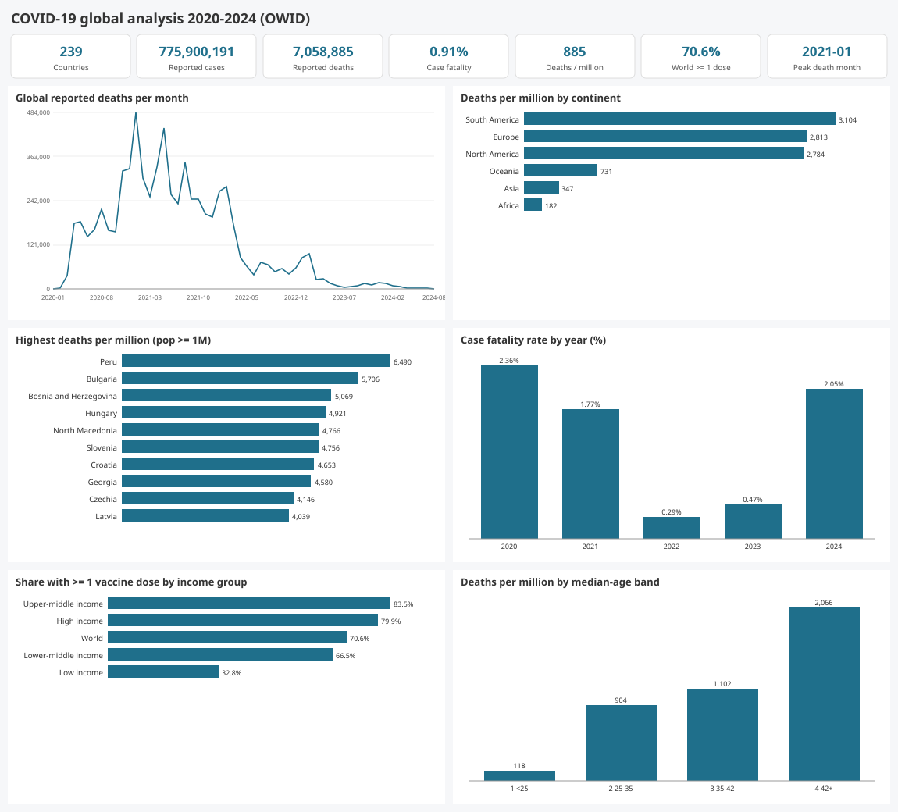
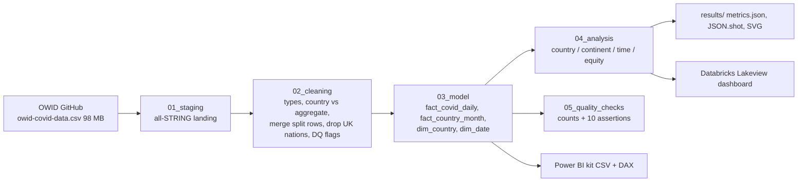

# da-learn-14 · COVID-19 global analysis (Our World in Data)

An end-to-end analyst project on the final **Our World in Data COVID-19 dataset**: 429,435 rows covering 255 entities from 2020-01-01 to 2024-08-14. The pipeline separates the 239 countries from OWID aggregates, merges split duplicate rows, and builds a star schema. It then compares cases, deaths and vaccinations across countries, continents and years, both in absolute terms and per capita. The same SQL runs on DuckDB locally and on Databricks SQL, where it is backed by a published Lakeview dashboard. A Power BI kit is included.



## Business questions
1. How many cases and deaths were reported worldwide, and what was the overall case fatality rate (CFR)?
2. Which continents and countries were hit hardest **per million people**?
3. How did the pandemic unfold over time? When did each continent peak, and how did CFR change by year?
4. How unequal was vaccine coverage across countries and World Bank income groups?
5. How do demographics (median age) relate to deaths per million?
6. Did countries with high vaccine coverage at the end of 2021 have fewer deaths afterwards?

## Pipeline


## Headline insights (full data)
- **Global toll.** Countries reported 775.9M cases and 7.06M deaths, which is 885 deaths per million and a CFR of 0.91%. Both totals reconcile to within 1% of OWID's own World row. The worst month was January 2021, with 484,000 reported deaths.
- **Per capita reverses the ranking.** South America has the highest rate at 3,104 deaths per million, followed by Europe (2,813) and North America (2,784). Asia (347) and Africa (182) are far lower, although Africa's figure is likely understated by limited testing. Peru is the worst country at 6,490 per million (CFR 4.88%), followed by Bulgaria (5,706) and Bosnia and Herzegovina (5,069). The US has the largest absolute count, 1.19M deaths, or 3,527 per million.
- **Lethality fell after 2021.** The yearly CFR went from 2.36% in 2020 to 1.77% in 2021, then 0.29% in 2022 (the Omicron year, with 424M cases), and was 0.47% in 2023. 2020 and 2021 together account for 77% of all reported deaths.
- **Vaccine inequity.** 70.6% of the world received at least one dose. Upper-middle-income countries reached 83.5% and high-income countries 79.9%, but low-income countries reached only 32.8%. Africa's coverage is 39.1%, and Burundi's is 0.29%.
- **Age drives mortality.** Among countries with at least 1M people, a median age of 42+ means 2,066 deaths per million, compared with 118 where the median age is under 25. The correlation between median age and deaths per million is 0.69. Countries with at least 75% coverage at the end of 2021 recorded 275 deaths per million from 2022 to 2024, against 541 in the 60–75% band. However, the band under 40% is younger (median age 22.9) and shows only 44, so age confounds this comparison.

Full tables are in [results/RESULTS.md](results/RESULTS.md) and [results/metrics.json](results/metrics.json).

## How to run
```bash
pip install -r requirements.txt            # duckdb
python run_pipeline.py --source sample     # 12-row committed sample in data/raw (seconds)
python scripts/download_full_data.py       # 98.4 MB into data/raw_full, SHA-256 verified
python run_pipeline.py --source full       # ~4 s -> results/, powerbi/data/, data/clean_full/
```
On the sample, the two "within 1% of OWID World" assertions FAIL by design, because only 5 countries are present. Everything else passes.
- **Databricks:** see [databricks/SETUP.md](databricks/SETUP.md).
- **Power BI:** see [powerbi/BUILD_GUIDE.md](powerbi/BUILD_GUIDE.md).

## Databricks
The notebook ran on Serverless Starter Warehouse against the full CSV (35 statements, 206 s). The dashboard **"da-learn-14 COVID-19 global analysis"** has 2 counters and 6 charts and is published. All 9 table row counts match DuckDB, and the KPI, continent, yearly, peak, band, income and DQ tables show 0 cell differences. See `databricks/run_outputs/duckdb_vs_databricks.json`.

## Repo layout
```
├── data/raw/                 12-row sample (4 countries + World on 2 dates, 1 split-duplicate pair) + data/README.md
├── sql/00..05                compat shim, staging, cleaning, star model, analysis, quality checks
├── run_pipeline.py           DuckDB runner (sample | full)
├── scripts/                  project config, SVG charts, Databricks builder, download + sample makers
├── databricks/               notebook (.sql), Lakeview dashboard (.lvdash.json), SETUP.md, run_outputs/
├── powerbi/                  star CSVs (sample-sized), measures.dax, model.md, dashboard_spec.md, BUILD_GUIDE.md
└── results/                  RESULTS.md, metrics.json, JSON.shot, charts/*.svg
```

## Caveats
- These are *reported* figures. Testing and reporting differ widely between countries; for example, Africa's low rate partly reflects under-ascertainment. From 2023 many countries reported weekly, which explains 351,142 zero-case days, and the 2024 numbers are sparse. That sparsity is why the 2024 CFR of 2.05% is not comparable with earlier years.
- Per-capita rates use OWID's single population column (UN WPP 2022). Six countries show more than 100% vaccinated, for example UAE and Qatar at 105.8%, because of non-resident vaccinations and stale population figures.
- The vaccination-band comparison is descriptive, not causal.

## Complete dataset
- **Kaggle page:** https://www.kaggle.com/datasets/caesarmario/our-world-in-data-covid19-dataset (a re-host of the same OWID file; the canonical source is https://github.com/owid/covid-19-data, archived August 2024)
- **Mirror used (exact URL):** https://raw.githubusercontent.com/owid/covid-19-data/master/public/data/owid-covid-data.csv
- **Licence:** Creative Commons BY 4.0 (Our World in Data). Cite it as Mathieu et al., *Coronavirus Pandemic (COVID-19)*, OurWorldInData.org.
- **Total size:** 98,391,483 bytes (~98.4 MB). SHA-256 is `8473d0f0fdf962e1ffbd5b85b18726fc96a49bab109e271186c339725a12b10c`.
- **Files:** `owid-covid-data.csv`, with 429,435 rows × 67 columns, 255 entities (239 countries after cleaning) and dates from 2020-01-01 to 2024-08-14.
- **Download:** `python scripts/download_full_data.py` (writes to data/raw_full/ and verifies SHA-256)
